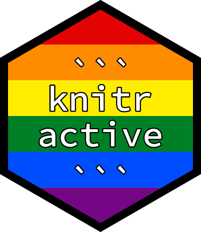

<!-- README.md is generated from README.Rmd. Please edit that file -->

# knitractive 

[](https://www.tidyverse.org/lifecycle/#experimental)

### Overview

The `knitractive` package provides a [knitr](https://yihui.name/knitr/)
engine that allows you to simulate interactive sessions (e.g., Python
console, Bash shell) across multiple code chunks. Interactive sessions
are run inside a [tmux](https://github.com/tmux/tmux/wiki) session
through the [tmuxr](https://github.com/datascienceworkshops/tmuxr) and
[rexpect](https://github.com/datascienceworkshops/rexpect) packages.

## Installation

You can install `knitractive` from GitHub with:

``` r
# install.packages("devtools")
devtools::install_github("datascienceworkshops/knitractive")
```

## License

The `knitractive` package is licensed under the MIT License.
