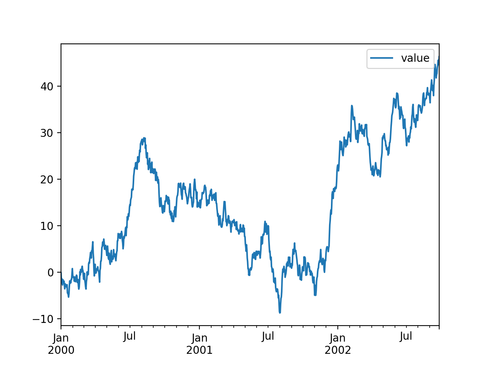

*View the corresponding [python.Rmd file](https://raw.githubusercontent.com/datascienceworkshops/knitractive/master/vignettes/examples/python.Rmd).*

```{r setup, include = FALSE}
library(knitractive)

engine <- ActiveEngine$new(
  name = "python",
  shell_command = "docker run --rm -it -v`pwd`:/data continuumio/anaconda3 python3",
  prompt = tmuxr::prompts$python,
  lexer = "pycon",
  keep_session = TRUE
)
engine$start()
```

```{r style, echo=FALSE, results='asis'}
add_style("perldoc", border = FALSE)
```

In this example, we're using the [continuumio/anaconda3](https://hub.docker.com/r/continuumio/anaconda3/) docker image to run Python.

```{python}
import pandas as pd
import matplotlib
Enter #~ literal = FALSE
matplotlib.use('agg')
pd.__version__
```

Because `knitractive` employs the [tmuxr](https://datascienceworkshops.github.io/tmuxr/) package under the hood, the python session is maintained, and we can continue where we left off.

```{python}
ts = pd.DataFrame({"value": pd.np.random.randn(1000)},
                  index=pd.date_range('1/1/2000',
                  periods=1000))
ts = ts.cumsum()
ts.head() #~ enter = FALSE, wait_for_prompt = FALSE
```

```{python, include = FALSE}
C-c #~ literal = FALSE, wait_for_prompt = TRUE
ts.head().to_html("/data/python_ts.html", border=0)
```

```{r, echo = FALSE}
htmltools::includeHTML("python_ts.html")
unlink("python_ts.html")
```

We've mapped the current working directory on the host to the directory `/data/` inside the docker container, so that we can include generated figures.

```{python}
ts.plot() #~ enter = FALSE, wait_for_prompt = FALSE
```

```{python, include = FALSE}
C-c #~ delay_before = 0.2, literal = FALSE, wait_for_prompt = TRUE
ts.plot().figure.savefig("/data/python_ts.png", dpi = 200)
```

```{r, echo = FALSE}

```


